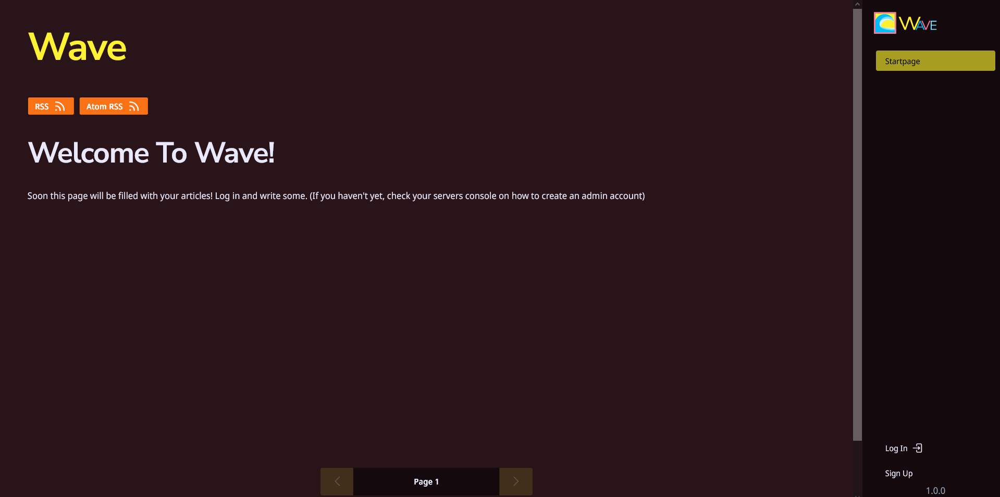
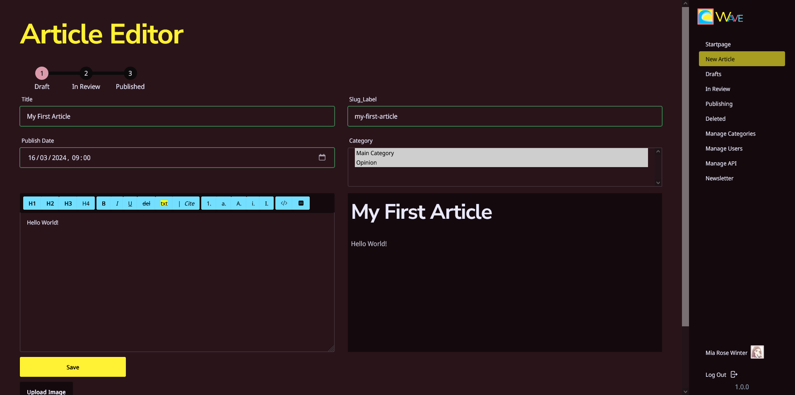
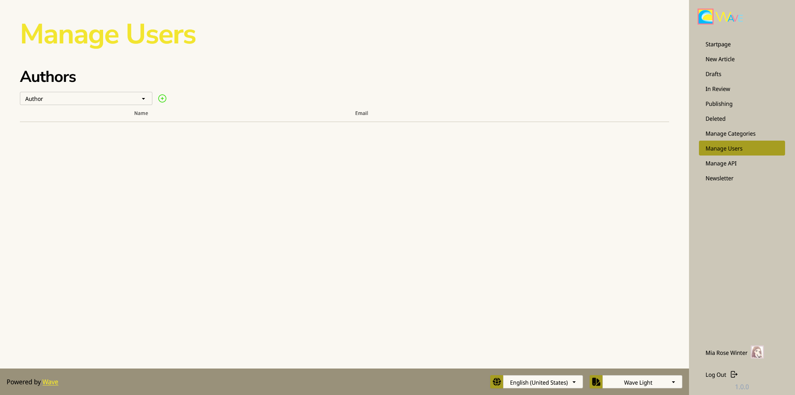
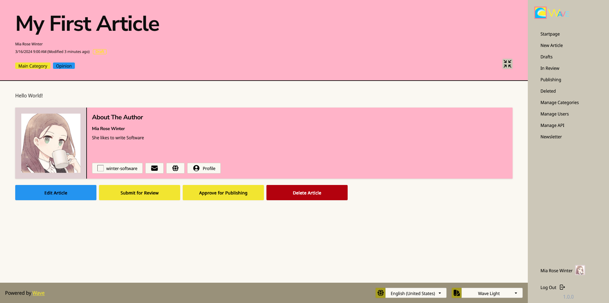
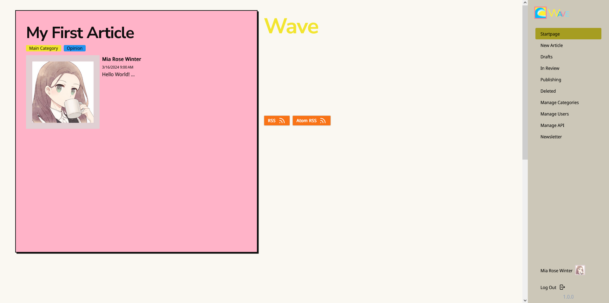
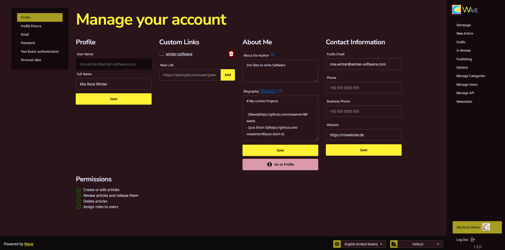
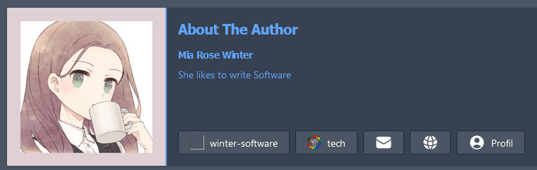
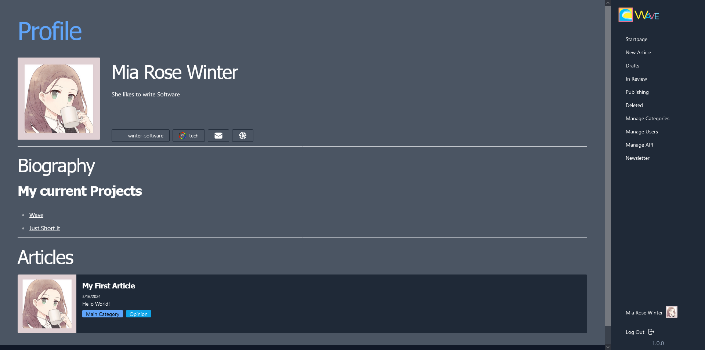
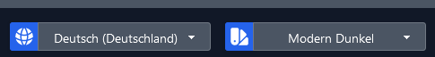



# Wave - The Collaborative Open-Source Blogging Engine
## Stay afloat in a current of Information









⚠ Beta ⚠ 

## Easy to set up

Jump right into the [Quickstart Guide](../../wiki/Quickstart) or check out 
[Wave Alpha](https://blog.winter-software.com/), which is always running the newest
version of Wave and has a ton of interesting blogs for you to explore.



## Easily create Articles



The Markdown enabled editor with lots of extras like pipe-tables and media embed 
like youtube allows you to create new blog articles nice and fast.

## Work together with others

You can add other people as authors or reviewers to your Wave installation, and allow 
them to also write on your site!



Authors can submit articles for review, and reviewers can submit them for publishing. 



Once reviewed and the publish date came, you will find it featured on the home page!



## Customize your profile 

You can customize your ABA card, as well as your Profile Biography, add contact 
information and custom links, as well as a profile picture and more!



These infos will then show up on pages related to you.





## RSS Support 

Want people to subscribe to everything? Specific people? Categories? Our RSS 
implementation got you covered!

## Email Distribution

Wave integrats SMTP support and extended support for mailtrap, allowing you to 
automatically distribute articles per Email to subscribers of it without any extra 
work, any article published that wasn't opt out will be delivered! Check out
the [Email-Newsletter Guide](../../wiki/Email-Newsletter)

## Themes and Languages

Wave currently supports two types of themes, "Wave" and "Modern", both as dark and 
light Theme, as well as US English, UK English and DE German. 



Missing your language? Consider contributing translations to Wave!

## Customization 

Wave allows you to customize various aspects of it, like the default language, theme, 
name of the site, description, and more! Check out the 
[Customizations Guide](../../wiki/Customization).

## License and Attribution

Wave by [Mia Winter](https://miawinter.de/) is licensed under the [MIT License](https://en.wikipedia.org/wiki/MIT_License).  

Copyright (c) 2024 Mia Rose Winter